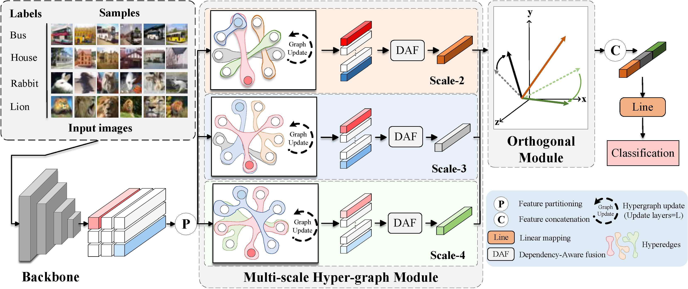

# HGNet: A Hypergraph for Classification Head to Capture Multi-scale Spatial Dependencies

The HGNet (tiny) model we have released is a classification head model with a standard graph structure (each edge connects two nodes), utilizing a graph alternating update strategy and Dependency-Aware Fusion (DAF) for the classification head design. Compared to HGNet (base), HGNet (tiny) has fewer parameters but lacks multi-scale hypergraph, sparse graph updates, and the orthogonal fusion module. After the publication of this paper, we will release the full version of the HGNet classification head model.

## Overall Structure of HGNet

## Intorduction
In traditional classification models, the standard classification head structures usually utilize basic pooling layers and fully connected layers to map image features. This mapping approach neglects the multi-scale spatial dependencies between features, often leading to the loss of significant discriminative information during the mapping process. To address this issue, we propose a novel hypergraph classification head structure (HGNet). HGNet constructs multi-scale hypergraphs based on the idea of feature partitioning, where the scale of the hypergraph depends on the number of nodes connected by each hyperedge. Additionally, by alternately updating the nodes and hyperedges within the hypergraph, we reveal the multi-scale spatial dependencies between feature blocks, enhancing the attention to discriminative information during the feature mapping process and improving the expressiveness of the mapped features.
