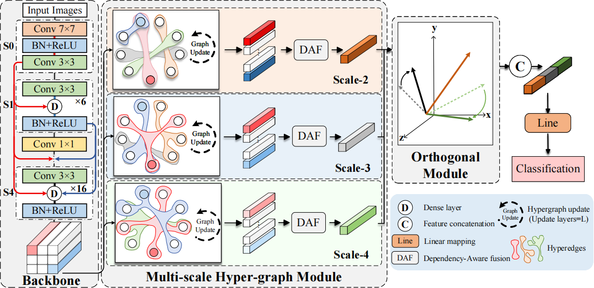

# HGNet: A Hypergraph for Classification Head to Capture Multi-scale Spatial Dependencies

The HGNet_T (tiny) model we have released is a classification network with a graph structure (each edge connects two nodes), utilizing a graph alternating update strategy and Dependency-Aware Fusion (DAF) for the classification network design. Compared to HGNet_B (base), HGNet_T (tiny) has fewer parameters but lacks multi-scale hypergraph, sparse graph updates, and the orthogonal fusion module. After the publication of this paper, we will release the complete HGNet classification network along with more detailed usage instructions.

## Overall Structure of HGNet

## Intorduction
In mainstream models, the traditional classification head typically uses a pooling layer to compress image features, followed by a fully connected layer to generate class probabilities. However, these methods overlook the loss of critical information during the classification head’s mapping process, which limits the model’s ability to predict class probabilities based on discriminative image features. To address this issue, we propose a replaceable hypergraph classification head (HGNet) to enhance the model’s ability to perceive discriminative information during the feature mapping process. HGNet constructs multi-scale hypergraphs in the feature space and captures spatial dependencies across feature blocks by alternately updating nodes and hyperedges, thereby mitigating the loss of discriminative information during feature mapping. To further reduce redundancy among homogeneous features at different scales, we introduce a multidimensional orthogonalization module (MOM). This module orthogonalizes these features and encourages each to focus on its own distinctive strengths. We replace traditional classification head in several backbone models and evaluate HGNet on four benchmark datasets. Experimental results demonstrate that HGNet is compatible with mainstream models and significantly boosts classification performance.

## Visualization

We visualize the image features of the final layer of ResNet101 and HGNet using Class Activation Mapping (CAM), and visualize the regions of focus in these output features.
